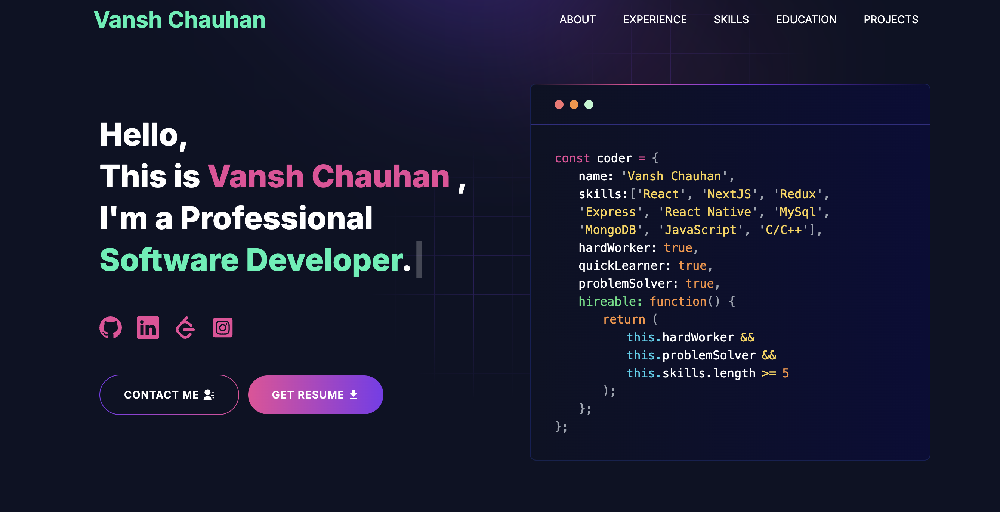

# My Portfolio

#### Hey :wave:, I'm Vansh Chauhan. This is my portfolio website. Please ⭐ the repo if you like it!
 
---

# Demo :movie_camera:



## View live preview [here](https://portfolio-vansh-chauhan.vercel.app/).
---

# Sections :bookmark:

- HERO SECTION
- ABOUT ME
- EXPERIENCE
- SKILLS
- PROJECTS
- EDUCATION
- CONTACTS

---

# Installation :arrow_down:
```

### Install packages from the root directory

```bash
npm install
# or
yarn install
```

Then, run the development server:

```bash
npm run dev
# or
yarn dev
```

Open [http://localhost:3000](http://localhost:3000) with your browser to see the result.

---

# Packages Used :package:

|   Used Package List    |
| :--------------------: |
|    @emailjs/browser    |
|  @next/third-parties   |
|         axios          |
|      lottie-react      |
|          next          |
|       nodemailer       |
|         react          |
|       react-dom        |
|   react-fast-marquee   |
| react-google-recaptcha |
|      react-icons       |
|     react-toastify     |
|         sharp          |
|          sass          |
|      tailwindcss       |
| 	 typewriter-effect   |
---